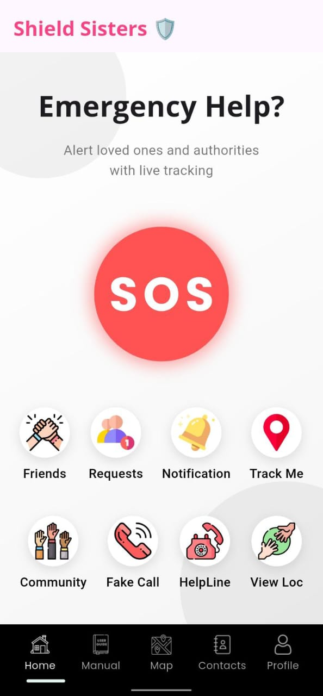
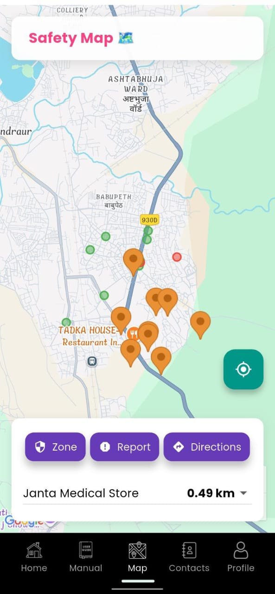
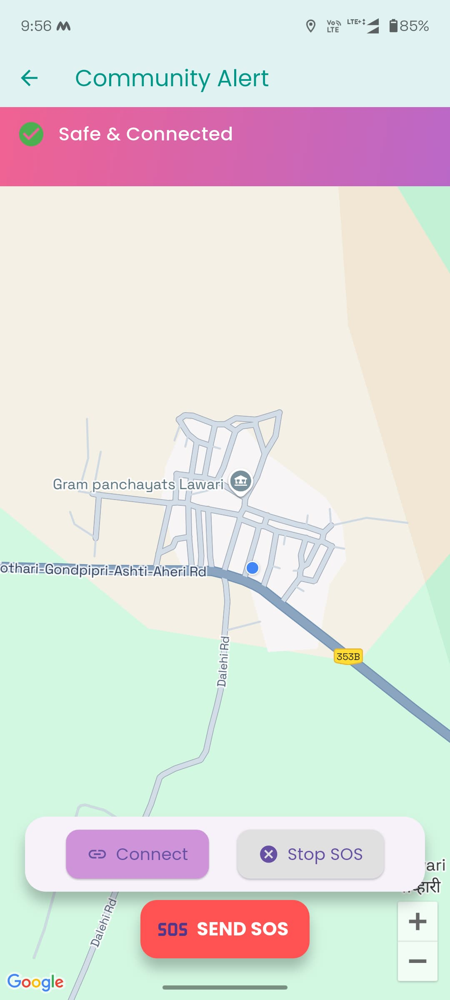

# SS2

 

**Shield Sister** is a safety companion app built using Flutter, designed to empower women with real-time SOS alerts, location sharing, and customizable privacy controls. With a warm, inviting UI and powerful backend, it ensures help is always just a tap away.

> “Your safety, your power – in your hands.”

---

## 📱 Download Now

- 🌐 **[Official Website](https://shieldsister.vercel.app/)**

---

## 🔧 Features

- 🚨 **One-Tap SOS**  
  Instantly alert your trusted contacts with your location and optional device info (battery, network status, etc.).

- 📍 **Real-Time Location Sharing**  
  Share your live location during emergencies or with loved ones on demand.

- 🛑 **Map-Based SOS Alerts**  
  View nearby active SOS incidents as blinking red markers for community awareness.

- ⚙️ **Customizable SOS Settings**  
  Choose what details are sent – battery %, device status, location, etc.

- 🔐 **Privacy First**  
  Full control over data sharing preferences with easily accessible toggles.

- 🎨 **Animated, Warm UI**  
  Designed with a soft color palette, animations, and intuitive sticker-style buttons.

- 🌐 **Firebase Integration**  
  Fast and secure backend using Firebase Auth, Firestore, and Cloud Functions.

---

## 📸 Screenshots

| Home Screen | Map Page | Community Page |
|------------|------------|----------------|
|  |  |  |

---

## 🚀 Tech Stack

- **Flutter** – Cross-platform UI development
- **Firebase** – Authentication, Firestore DB, Cloud Functions
- **Google Maps API** – For live map and location tracking
- **Custom Theming** – Warm gradients, animated buttons, Google Fonts

---

## 💡 Getting Started (Developers)

```bash
git clone https://github.com/Manish-128/SS2.git
cd SS2
flutter pub get
flutter run
